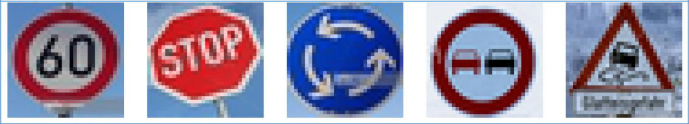

> Self-Driving Car Engineer Nanodegree - Deep Learning
>
> Project: Build a Traffic Sign Recognition Classifier

**\#\#\#\#1. Provide a basic summary of the data set and identify where
in your code the summary was done. In the code, the analysis should be
done using python, numpy and/or pandas methods rather than hardcoding
results manually.**

**(The code for this step is contained in the second code cell of the
IPython notebook)**

**I used the Numpy library to calculate summary statistics of the
traffic signs data set:**

-   **The size of training set is ?**

-   Number of training examples = 34799

-   **The size of test set is ?**

-   Number of testing examples = 12630

-   **The shape of a traffic sign image is ?**

-   Image data shape = (32, 32, 3)

-   **The number of unique classes/labels in the data set is ?**

-   Number of classes = 43

<!-- -->

-   DATA SUMMARY \*\*\*\*

  ------------------- ------
  Number of classes   = 43
  ------------------- ------

Number of training examples = 34799

Number of validation examples = 4410

Number of testing examples = 12630

Image data shape = (32, 32, 3)

Image data type = &lt;class 'int'&gt;

**\#\#\#\#2. Include an exploratory visualization of the dataset and
identify where the code is in your code file.**

**(The code for this step is contained in the third code cell of the
IPython notebook.)**

[]{#page2 .anchor}Here is an exploratory visualization of the data set.
All 43 classes are present in the plot:

> **Figure-**Error! No text of specified style in document.**-1 Image
> sample for each of 43 classes**

The following histogram shows the data distribution:

**Figure -**Error! No text of specified style in document.**-2 Histogram
of Class on Training Data Set**

[]{#page3 .anchor}

**\#\#\#Design and Test a Model Architecture**

**\#\#\#\#1. Describe how, and identify where in your code, you
preprocessed the image data. What techniques were chosen and why did you
choose these techniques? Consider including images showing the output of
each preprocessing technique. Pre-processing refers to techniques such
as converting to grayscale, normalization, etc.**

**(The code for this step is contained in the fourth code cell of the
IPython notebook)**

Pre-Processing:

1- Convert to grayscale

-according to the LeNet paper color did not improve the accuracy of
results and also it would involve more computations.

-this was done using a formula : 0.299xR + 0.587xG + 0.114xB

2 - Normalization

-   this is a recommended practice to be in the range 0-1 -this was done
    by dividing by 255

3 - Equalize the exposure

-   some images were very dark others very bright, therefore it was
    necessary to correct by using the skimage library
    exposure.equalize\_adapthist

4 - Center the value around the mean

- this would make the mean around zero, which is a recommended practice
for neural networks. It makes the solver easier to find convergence.

The following plot shows all 43 classes after post processing for
comparison:

[]{#page4 .anchor}

> **Figure -**Error! No text of specified style in document.**-3 Image
> sample for 43 classes after post-processing**

**\#\#\#\#2. Describe how, and identify where in your code, you set up
training, validation and testing data. How much data was in each set?
Explain what techniques were used to split the data into these sets.
(OPTIONAL: As described in the "Stand Out Suggestions" part of the
rubric, if you generated additional data for training, describe why you
decided to generate additional data, how you generated the data,
identify where in your code, and provide example images of the
additional data)**

**(The code for splitting the data into training and validation sets is
contained in the fifth code cell of the IPython notebook.)**

The data was already into 3 sets: training(34799 images),
validation(4410 images), and test(12630 images).

Since the performance of the neural network was low (0.92 accuracy) and
the class distribution on the training set was not even, I augmented the
classes that had a low count. This was done by using a multiplier of the
class (calculated by diving the count of the class that has the most
images dividing by the class to be augmented). Below is an example of
the output while augmenting the classes:

\*\*\*\*\* TRAINING DATA \*\*\*\*\*

[]{#page5 .anchor}

X\_train size is= (34799, 32, 32, 1) and y\_train size is= (34799,)
(BEFORE AUGMENTING) i= 0 size= (210, 32, 32, 1) augmented by= 10 times

.. ..

i= 42 size= (210, 32, 32, 1) augmented by= 8 times

X\_train size is= (74217, 32, 32, 1) and y\_train size is= (74217,)
(AFTER AUGMENTING)

Shown below is a histogram of the training data classes before and after
augmentation:

> **Figure** Error! No text of specified style in document.**-4
> Histogram of Training Data Set before and after Augmentation**

**\#\#\#\#3. Describe, and identify where in your code, what your final
model architecture looks like including model type, layers, layer sizes,
connectivity, etc.) Consider including a diagram and/or table describing
the final model.**

**(The code for my final model is located in the seventh cell of the
ipython notebook.)**

The final architecture used was as follows:

  ------------- ----------------------------------------------------- ------------- --------------
  > **Layer**   > **Type**                                            > **Input**   > **Output**
                > Input                                                             32x32x1
  > Conv1       > Convolution using 5x5x1x6 filters stride 1x1x1x1    32x32x1       28x28x6
  > Conv1       > Activation ReLU                                     28x28x6       28x28x6
  > Conv1       > Max Pooling size 1x2x2x1 strides 1x2x2x1            28x28x6       14x14x6
  > Conv2       > Convolution using 5x5x6x16 filters stride 1x1x1x1   14x14x6       10x10x16
  > Conv2       > Activation ReLU                                     10x10x16      10x10x16
  > Conv2       > Max Pooling size 1x2x2x1 strides 1x2x2x1            10x10x16      5x5x15
  > FC0         > Flatten Conv2                                       5x5x15        400
  ------------- ----------------------------------------------------- ------------- --------------

  ------------------------- ------------------------------------------------ ----- -----
  > []{#page6 .anchor}FC1   > Classifier                                     400   120
  > FC1                     > Activation ReLU                                120   120
  > FC2                     > Classifier                                     120   84
  > FC2                     > Activation ReLU                                84    84
  > FC3                     > Outputs Logits                                 84    10
                            > **Figure 0-5 Architecture used for Network**         
  ------------------------- ------------------------------------------------ ----- -----

**\#\#\#\#4. Describe how, and identify where in your code, you trained
your model. The discussion can include the type of optimizer, the batch
size, number of epochs and any hyper parameters such as learning rate.**

**(The code for training the model is located in the eigth cell of the
ipython notebook.)**

The type of optimizer used was the Adam Optimizer.

The batch size used was 128 which worked well for the computer I used
(memory limitations). I studied the sensitivity of batch size ranging
from 1 to 32768 and found that the range of 64-128 was a good compromise
for my computer.

The number of epochs was set to 30, that was enough to converge on an
accuracy of around 0.97. Before data augmentation or before image
processing an epochs number of 10 was good enough to reach convergence
on accuracy that was around 0.92-0.93.

The learning rate was set to 0.001. This resulted in a training time of
1265secs for my computer (with an AMD FX8350 CPU).

Shown below is an image showing convergence of the accuracy vs. epochs:

> **Figure 0-6 Accuracy of Validation vs. Epochs**

**\#\#\#\#5. Describe the approach taken for finding a solution. Include
in the discussion the results on the training, validation and test sets
and where in the code these were calculated. Your approach may have been
an iterative process, in which case, outline**

[]{#page7 .anchor}**the steps you took to get to the final solution and
why you chose those steps. Perhaps your solution involved an already
well known implementation or architecture. In this case, discuss why you
think the architecture is suitable for the current problem.**

**(The code for calculating the accuracy of the model is located in the
ninth cell of the Ipython notebook.)**

**My final model results were:**

-   validation set accuracy of 0.94 - 0.97 (range varying each run)

-   test set accuracy of ? 0.92 - 0.94 (range varying each run)

**If a well known architecture was chosen:**

-   **What architecture was chosen?**

-   the LeNet basic architecture from the MNIST problem.

-   **Why did you believe it would be relevant to the traffic sign
    > application?**

-   it was already proven to work well with the MNIST set, which had
    > basic characters on it. I thought traffic sign would not have very
    > complex feature, so it would be a good starting point.

-   **Adjustments:**

-   It was using 3 colors, so the tensors were in the form (\*,32,32,3).
    > This was changed to a single color in the form of (\*,32,32,1)

-   Pooling and convolution were part of the original architecture and I
    > did not touch them because they are basic to this type of image
    > recognition technique.

-   Dropout-&gt; I introduced dropout with a probability of 0.5, but it
    > decreased the accuracy to 0.635.

-   I tried connecting CONV1 to the FC1, but the accuracy was not any
    > better.

-   I tried connecting CONV1 to FC1 with dropouts and accuracy was
    > 0.732.

-   I tried adding an extra CONV3 layer and fully connecting all3 CONV
    > layers to the FC layers, and the accuracy dropped from 0.93 to
    > 0.91.

-   I tried a random rotation on the training set images of +/-15deg as
    > part of the pre-processing, but it resulted in a very low accuracy
    > of 0.05.

-   The adjustments that were the most relevant in terms of improving
    > accuracy were: image histogram equalizer and centering around the
    > mean.

[]{#page8 .anchor}

-   **How does the final model's accuracy on the training, validation
    > and test set provide evidence that the model is working well?**

-   The accuracy for the validation set is in the range of 0.94-0.97
    > where the accuracy of the test set is in the range of 0.92-0.935.
    > Since the accuracy is not that different that is an indication
    > that there is not over-fitting.

**\#\#\#Test a Model on New Images**

**\#\#\#\#1. Choose five German traffic signs found on the web and
provide them in the report. For each image, discuss what quality or
qualities might be difficult to classify.**

Here are five German traffic signs that I found on the web (they were
cropped to a square size and resized to 32x32 pixels):

**Figure 0-7 Five traffic sign images from the web.**

The second image (stop sign) might be difficult to classify because it
has a large rotation angle. The third image has a smear on pixels, so it
may be difficult also.

**\#\#\#\#2. Discuss the model's predictions on these new traffic signs
and compare the results to predicting on the test set. Identify where in
your code predictions were made. At a minimum, discuss what the
predictions were, the accuracy on these new predictions, and compare the
accuracy to the accuracy on the test set .**

**(The code for making predictions on my final model is located in the
tenth cell of the Ipython notebook.)**

[]{#page9 .anchor}The model predictions are output as a matrix with
Logits and a matrix with the corresponding classes:

  ------------------ -------------------------------------- ------------------ ------------------ ------------------ -- -- -- --
  \*\*\*\*\*\* TOP   > 5 PROBABILITY SOFTMAX \*\*\*\*\*\*   
  \[\[               1.00000000e+00                         > 2.58599808e-11
                     3.64668648e-16\]                       
  > \[               9.98302460e-01                         > 8.39782238e-04
                     5.98458064e-05\]                       
  > \[               7.19871759e-01                         > 1.46719128e-01
                     1.55169126e-02\]                       
  > \[               1.00000000e+00                         > 1.86763538e-09
                     1.62359767e-14\]                       
  > \[               9.41756010e-01                         > 5.47845289e-02
                     2.46777108e-06\]\]                     
  \*\*\*\*\*\* TOP   > 5 PROBABILITY CLASS                  \*\*\*\*\*\*
  \[\[ 3             5                                      2
  > \[14             39                                     33
  > \[40             12                                     1
  > \[ 9 10 40       35                                     17\]
  > \[23 29          3                                      31
  ------------------ -------------------------------------- ------------------ ------------------ ------------------ -- -- -- --

Here are the results of the prediction for the 5 images:

> **Figure 0-8 Results Predictions for Web Images**

The model was able to correctly guess 4-5 of the 5 traffic signs most of
the sign, which is consistent with the accuracy of the test set.
Sometimes it could have trouble with the STOP sign because of the large
rotation of the image.

**\#\#\#\#3. Describe how certain the model is when predicting on each
of the five new images by looking at the softmax probabilities for each
prediction and identify where**

> []{#page10 .anchor}**in your code softmax probabilities were
> outputted. Provide the top 5 softmax probabilities for each image
> along with the sign type of each probability**
>
> **(The code for making predictions on my final model is located in the
> 11th cell of the Ipython notebook.)**
>
> The model is not very certain with the new images , even on figures
> that are classified correctly (the 60km/h , no passing, and slippery
> road images), because the probabilities are only slightly above 50%.
> Three images were classified correctly, and 2 incorrectly, shown
> below:

  ----------------------------- ------------------ ------------------------------- ------------------ ------------------ ------------------------------- -------------------------------- ---------------------- --------------------- --------------------- --------------- --
                                                                                                                                                                                                                                                                             
  > 100% class= 3 Speed limit   > 99 % class= 14   > Stop                          > 73 % class= 40   > Roundabout       > 100.0 % class= 9 No passing   > 94 % class= 23 Slippery
  > (60km/h)                                       > 0.1 % class= 39               > Keep left        > mandatory                                                                         > 1e-07 % class= 10    > No passing          > road                                
  > 2.e-09 % class= 5           Speed limit        > 0.05% class= 33               > Turn right       > 15 % class= 12   > Priority road                 > for vehicles over 3.5 metric   > 5% class= 29         Bicycles
  > (80km/h)                                       > ahead                                            > 6 % class= 1     > Speed limit                   > tons                                                  > crossing                                  
  > 7e-13 % class= 2            Speed limit        > 0.01 % class= 3               > Speed limit      > (30km/h)                                                                          > 1 e-10 % class= 40                         > 0.3 % class= 3      > Speed limit
  > (50km/h)                                       > (60km/h)                                         > 2 % class= 5     > Speed limit                   > Roundabout mandatory           > (60km/h)                                   
  > 2e-13 % class= 39           Keep left          > 0.005 % class= 34 Turn left   > (80km/h)                                                            > 6 e-11 % class= 35             > Ahead                > 0.0003% class= 31   Wild
  > 3e-14 % class= 33           Turn right         > ahead                                            > 1 % class= 14                                    Stop                             > only                                       > animals crossing    
  > ahead                                                                                                                                                                                 > 1 e-12 % class= 17   > No entry            > 0.0002 % class= 5   Speed
                                                                                                                                                                                                                                       > limit (80km/h)      
  ----------------------------- ------------------ ------------------------------- ------------------ ------------------ ------------------------------- -------------------------------- ---------------------- --------------------- --------------------- --------------- --

> **Figure 0-9 Classified Web Images with
> Probabilities**
>
> **\#\#\#\#4. Feature maps**
>
> The output feature maps were applied to the first image found on the
> web to interpret the first convolution layer output (see image below):

> **Figure 0-10 Feature map of the first convolution layer applied to
> 60km/h image**

It can be seen how different features are picked up more depending on
the feature map. For example feature maps 3 and 4 highlight the circle
edges.
